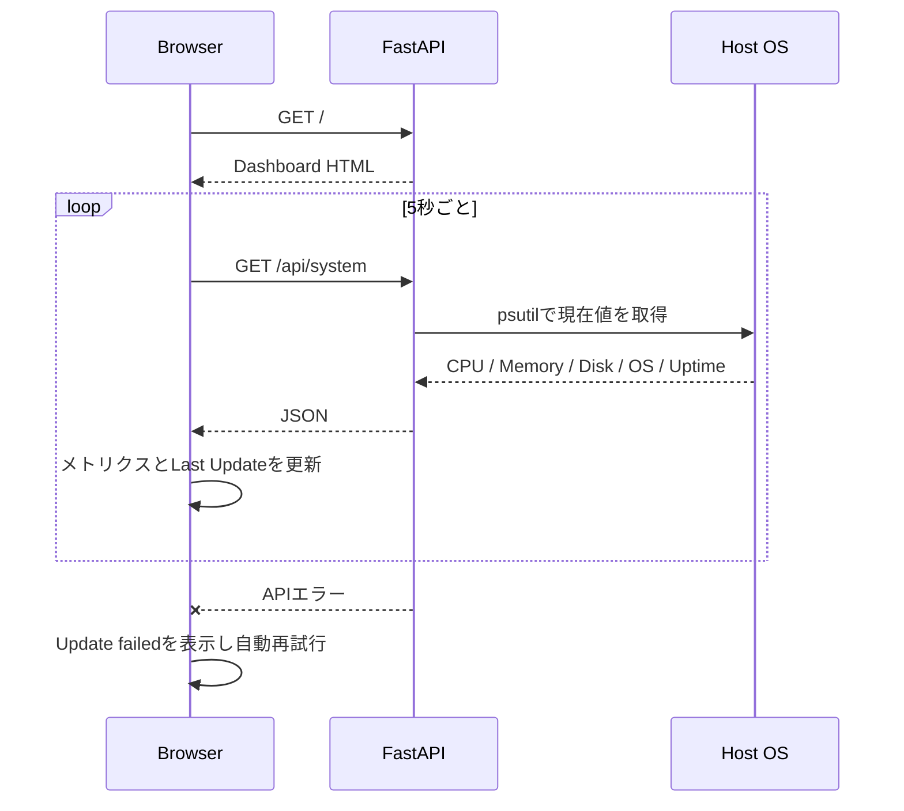

# system-monitor-dashboard

ローカルPCの状態をブラウザから確認できる、軽量なシステムモニターダッシュボードです。

CPU・メモリ・ディスク・OS・Uptimeを1画面に集約し、5秒ごとの自動更新とAPI障害時の復旧表示までを含む、Python / Web API / CI / 運用設計のポートフォリオです。

## 解決する課題

開発中のPC、検証用サーバー、ローカルLLMホストなどで、現在のリソース状態をすぐ確認したい場面を想定しています。

- CPUやメモリの逼迫を早期に確認する
- ディスク容量の消費状況を確認する
- ローカルサービスの稼働ホストとUptimeを把握する
- API停止時に、画面が古い値を表示し続けず復旧待ちであることを伝える

## 想定利用者と利用シーン

| 利用者 | 利用シーン | 確認できること |
| --- | --- | --- |
| 開発者 | ローカル開発環境の確認 | CPU、メモリ、ディスクの現在値 |
| 運用担当者 | 検証用ホストの一次確認 | OS、Uptime、API応答状態 |
| AI開発担当者 | ローカルLLMサーバーの前段確認 | 推論ホストのリソース逼迫 |
| 保守担当者 | 障害切り分けの初期確認 | 更新時刻、Live / Update failed |

機密情報、認証情報、履歴データを収集する製品ではありません。単一ホストの現在状態を確認するV1として範囲を限定しています。

## 動作イメージ



画面が正常なときは `Live`、更新中は `Updating…`、APIに失敗したときは `Update failed` とエラーパネルを表示します。APIが復旧すると、次回の自動更新でLiveへ戻ります。

## V1で提供する機能

- CPU使用率
- メモリ使用量・使用率
- ディスク使用量・使用率
- OS情報
- Uptime
- `GET /api/system`
- Webダッシュボード
- 5秒間隔の自動更新
- API取得失敗時のエラー表示と自動復旧
- レスポンシブなカードレイアウト

## 技術構成

| 層 | 技術 | 役割 |
| --- | --- | --- |
| API | Python / FastAPI | HTML配信とシステム情報API |
| システム情報 | psutil | CPU、メモリ、ディスク、Boot時刻を取得 |
| UI | HTML / CSS / JavaScript | メトリクス表示、自動更新、エラー状態 |
| ASGIサーバー | Uvicorn | ローカル開発サーバー |
| テスト | pytest / FastAPI TestClient | API・システム情報の構造と境界を検証 |
| CI | GitHub Actions | import / syntax checkとpytestをPR・main pushで実行 |

## API設計

### `GET /`

ブラウザなど`Accept: text/html`のリクエストにはDashboard HTMLを返します。それ以外のクライアントには、互換性維持のため次を返します。

```json
{"status": "ok"}
```

### `GET /api/system`

現在のシステム情報を次の形式で返します。

```json
{
  "cpu_percent": 24.1,
  "memory": {"used_gb": 8.5, "total_gb": 16.0, "percent": 53.1},
  "disk": {"used_gb": 143.0, "total_gb": 256.0, "percent": 55.9},
  "os": "macOS",
  "uptime_seconds": 301400
}
```

CPU、メモリ、ディスクの割合は0〜100%に収め、容量はGiB換算の小数1桁、Uptimeは秒で返します。ディスクの割合はOSが返す値ではなく、`used / total * 100`から計算し、totalが0の場合は0%とします。

## テストと品質確認

ローカルでは次を実行します。

```bash
pytest -q
python -m compileall -q app tests
```

テストでは、次を確認しています。

- `/api/system`のレスポンス構造とHTTP 200
- HTMLクライアントへのDashboard配信
- CPU、メモリ、ディスク、OS、Uptimeの変換と丸め
- 実マシン値の範囲
- ディスクtotalが0の場合
- OSやpsutil値をモックした決定的な境界ケース

GitHub Actionsでは、Python 3.12環境で依存関係をインストールし、import / syntax checkとpytestを実行します。CIが失敗しているPRは完了扱いにしません。

## 手動確認

1. `uvicorn app.main:app --reload`で起動する。
2. <http://127.0.0.1:8000/> を開き、CPU、Memory、Disk、OS、Uptime、Last Updateを確認する。
3. 5秒以上待ち、Last Updateとメトリクスが更新されることを確認する。
4. Uvicornを停止し、`Update failed`とエラーパネルを確認する。
5. Uvicornを再起動し、次回更新で`Live`へ戻ることを確認する。

## セットアップ

```bash
python -m venv .venv
source .venv/bin/activate
python -m pip install -r requirements.txt
uvicorn app.main:app --reload
```

Windowsでは仮想環境の有効化コマンドを環境に合わせて変更してください。

## V1の制約と未実装

現在のV1では、次の機能を実装していません。

- GPU監視
- 温度監視
- ネットワーク監視
- Docker監視
- ローカルLLM監視
- データベースや履歴保存
- 認証・権限管理
- 通知
- グラフ表示
- 複数ホストの一覧監視

したがって、公開ネットワークへそのまま置く監視製品ではありません。複数利用者・複数ホスト・長期分析が必要な案件では、認証、TLS、収集エージェント、保存期間、通知ポリシーを追加設計します。

## AI開発案件での応用例

既存のFastAPI / psutil / CIの構成を、次のようなAI基盤の運用画面へ発展できます。

- ローカルLLMサーバーのCPU、メモリ、ディスク、Uptime監視
- RAG検索APIやEmbedding処理ワーカーの稼働確認
- 推論待ち時間、キュー長、エラー率などのメトリクス追加
- モデル切り替えや再インデックス処理の運用画面
- コンテナ・GPU・複数ホストを対象にした監視基盤

ただし、GPU、LLM、履歴保存、通知などはこのIssueの実装対象ではなく、将来拡張として扱います。

## プロジェクトルール

GitHub Issueを仕様の基準とし、原則 **1子Issue = 1 PR** で進めます。既存機能を壊さず、Issue範囲外の機能追加は行いません。詳細は [`AGENTS.md`](AGENTS.md) を参照してください。
